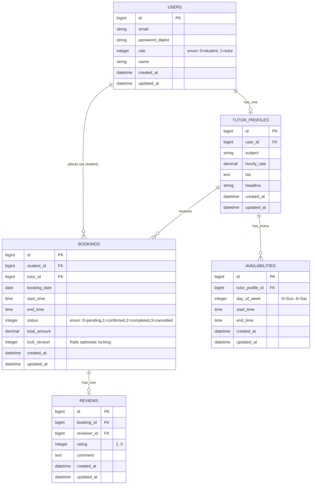

# TutorHub — Architecture & ERD

## Entity Relationship Diagram



## Indexes & Constraints

| Table | Index / Constraint | Purpose |
|---|---|---|
| `users` | `UNIQUE (email)` | One account per email |
| `users` | `role` index | List filter by role |
| `tutor_profiles` | `UNIQUE (user_id)` | Has-one enforcement |
| `availabilities` | `(tutor_profile_id, day_of_week)` | Speed up weekly lookup |
| `bookings` | `UNIQUE (tutor_id, booking_date, start_time)` | **Race-proof double-booking prevention** |
| `bookings` | `student_id`, `tutor_id`, `status` | Filter speed |
| `reviews` | `UNIQUE (booking_id)` | One review per booking |

The **`UNIQUE (tutor_id, booking_date, start_time)`** on `bookings` is the keystone of the concurrency story. It guarantees that even if two requests hit the server at literally the same moment and both pass application-layer validation, only one INSERT will succeed — Postgres itself returns `23505 unique_violation`, which `BookingService` translates to `BookingConflictError`.

## Service-Object Architecture

```
HTTP Request
    │
    ▼
BookingsController#create
    │
    ▼
BookingService.call(...)          ◄── Single entry point
    │
    ├── (1) AvailabilityChecker.is_available?(tutor, slot)   ◄── PORO with unit tests
    │
    ├── (2) Booking.create!  ──wrapped in transaction──►      ◄── AR + optimistic locking
    │       ├── if ActiveRecord::RecordNotUnique → BookingConflictError
    │       └── if ActiveRecord::StaleObjectError → BookingConflictError
    │
    └── (3) return :ok + booking
```

Notice **no business logic lives in the controller**. Each PORO is unit-testable in isolation.

## Auth Flow

```
GET  /login           → SessionsController#new
POST /login           → SessionsController#create (sets session[:user_id])
DELETE /logout        → SessionsController#destroy

GET  /signup          → RegistrationsController#new
POST /signup          → RegistrationsController#create (User.create + role-dependent setup)

ALL other actions → Authenticatable concern → require_login
```

The `Authenticatable` concern is included in `ApplicationController`. It exposes `current_user` (memoized) and `require_login` (filter). `require_login` redirects to `/login` with a flash if no session is present.

## Report Pipeline (Raw SQL)

The `ReportQuery` class is the answer to the JD's "**SQL (big plus)**" line item. Instead of leaning on ActiveRecord's query interface, the three reports use:

1. **Tutor search by availability window** — `NOT EXISTS` to detect available tutors for a given `(day, time-range)`.
2. **Monthly revenue per tutor** — three-table `JOIN` + `GROUP BY` + `SUM`.
3. **Top tutors** — `RANK() OVER (ORDER BY booking_count DESC)` window function, then `LIMIT`.

Each query lives as a clearly-commented `ActiveRecord::Base.connection.exec_query(...)` inside a class method, and has a dedicated RSpec asserting the expected result set.
